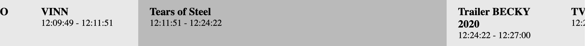

# @consuo/web-component-up-next

A simple Web component that from the Consuo Schedule API fetches the schedule and show as a single channel epg component.



## Install

```
npm install --save @consuo/web-component-epg
```

## Tutorial

As this is a standard Web Component you can use it as any other html element, when imported.

Import the web component class in your JavaScript

```javascript
import "@consuo/web-component-epg";
```

and use it in your html

```html
<consuo-epg api-url="" channel-id="" update-interval=""></consuo-up-next>
```

or entirely in JavaScript, just as any other standard html element.

```javascript
import '@consuo/web-component-epg';

const consuoUpNext = document.createElement("consuo-epg");
consuoUpNext.setAttribute("api-url", api_url);
consuoUpNext.setAtribute("channel-id", channel_id);

container.appendChild(consuoUpNext);
```

## Properties

- api-url: `string` `required`

    URI to the Consuo Schedule endpoint.

- channel-id: `string` `required`

    The ID of the channel.

- update-interval: `number`

    If provided the component is updated by the specified interval in seconds.

## About Consuo

`Consuo` is a software component (Docker container) that can be plugged into your online video platform to provide you with unlimited thematic, regional or personal linear TV channels based on an existing VOD library.

Visit www.consuo.tv for more information and to request a trial license.

## About Eyevinn Technology

Eyevinn Technology is an independent consultant firm specialized in video and streaming. Independent in a way that we are not commercially tied to any platform or technology vendor.

At Eyevinn, every software developer consultant has a dedicated budget reserved for open source development and contribution to the open source community. This give us room for innovation, team building and personal competence development. And also gives us as a company a way to contribute back to the open source community.

Want to know more about Eyevinn and how it is to work here. Contact us at work@eyevinn.se!
